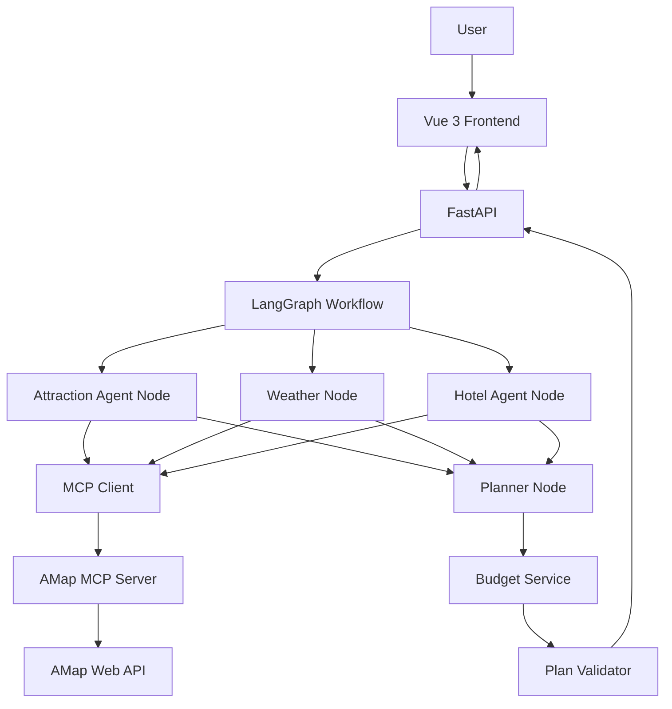
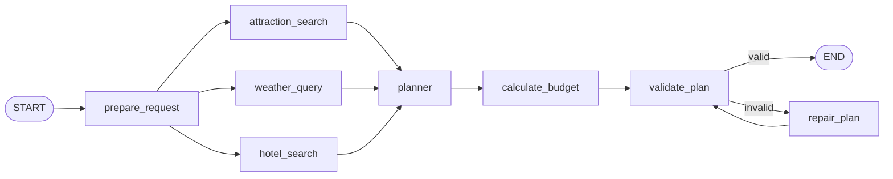

# TripPilot：基于 LangGraph 的多智能体智能旅行规划系统

> 项目定位：用于学习、GitHub 展示与求职简历的 AI Agent 工程项目  
> 核心目标：在参考《第十三章 智能旅行助手》的产品闭环基础上，使用 **LangGraph + MCP + FastAPI + Vue 3** 重新实现，并做出明确的工程升级，而不是简单复刻 HelloAgents 版本。  
> 当前开发策略：**先跑通核心 Agent 工作流，再接后端 API，再做前端，最后做工程增强与项目包装。**

---

## 0. 文档使用方式

这份文档不是项目介绍，而是整个 TripPilot 的**开发主线文档**。

实际开发时遵循以下原则：

1. 严格按照 Iteration 1 → 2 → 3 → 4 的顺序推进。
2. 每完成一个小步骤，先运行测试，再进入下一步。
3. 第一目标永远是“跑通”，第二目标才是“优化”。
4. 不提前加入数据库、登录、长期记忆等与核心 Agent 无关的复杂功能。
5. 每个 Iteration 都必须有可运行结果，不能等到最后才集成。
6. 任何外部工具接入前，优先用 mock 数据验证 LangGraph 节点和数据流。
7. LLM 负责理解、选择、规划；确定性业务逻辑由 Python 完成。

---

# 1. 项目背景

旅行规划是一个典型的多步骤 AI 应用场景。

用户通常需要同时处理：

- 搜索景点
- 查询天气
- 选择酒店
- 安排每日路线
- 控制预算
- 根据偏好做个性化选择
- 查看地图
- 根据结果再次修改

传统旅行攻略的问题主要包括：

- 信息来源分散
- 搜索与整理成本高
- 缺乏个性化
- 修改计划后需要重新手动调整
- 很难同时兼顾天气、位置、预算和用户偏好

TripPilot 的目标是将这些任务组织成一个可解释、可追踪、可扩展的 Agent Workflow。

---

# 2. 项目目标

## 2.1 产品目标

用户输入：

- 目的地
- 开始日期
- 结束日期
- 兴趣偏好
- 预算级别
- 交通偏好
- 住宿类型

系统自动完成：

1. 搜索真实景点
2. 查询真实天气
3. 搜索真实酒店
4. 根据旅行天数、偏好、天气和地理位置生成每日行程
5. 自动计算预算
6. 校验最终计划
7. 返回结构化 TripPlan
8. 在 Web 页面展示
9. 在地图中标注景点
10. 后续支持编辑和导出

---

## 2.2 技术目标

这个项目必须真正体现以下能力：

- LangGraph
- Stateful Workflow
- Multi-Agent / Agent Nodes
- Tool Calling
- MCP
- Parallel Execution
- Structured Output
- Pydantic
- FastAPI
- Async Python
- Vue 3
- TypeScript
- Error Handling
- Testing
- Docker
- LLM Application Engineering

---

## 2.3 简历目标

项目最终需要能够支撑如下类型的简历描述：

> 基于 LangGraph 构建多智能体旅行规划系统，将景点搜索、天气查询、酒店推荐等任务拆分为独立节点并行执行，通过共享 State 完成信息聚合；集成高德地图 MCP 实现真实 POI、天气与位置工具调用，并使用 Pydantic Structured Output 与确定性预算计算提升结果稳定性。后端采用 FastAPI 提供异步 API，前端使用 Vue 3 展示行程、预算及地图信息。

注意：

**只有真正实现的能力才能写入简历。**

---

# 3. 与参考项目的关系

参考项目的核心业务链路保留：

```text
用户需求
  ↓
景点搜索
  ↓
天气查询
  ↓
酒店推荐
  ↓
行程规划
  ↓
预算
  ↓
地图展示
```

但 Agent 架构重新设计。

参考项目主要采用多个 Agent 顺序执行：

```text
AttractionSearchAgent
        ↓
WeatherQueryAgent
        ↓
HotelAgent
        ↓
PlannerAgent
```

TripPilot 改为：

```text
                         ┌── Attraction Node ──┐
                         │                     │
prepare_request ─────────┼── Weather Node ─────┼── Planner
                         │                     │
                         └── Hotel Node ────────┘
                                                    ↓
                                               Budget
                                                    ↓
                                               Validator
                                                    ↓
                                                   END
```

核心变化：

| 参考实现 | TripPilot |
|---|---|
| HelloAgents | LangGraph |
| 多 Agent 串行 | 可并行节点并行执行 |
| 字符串结果传递 | Typed Shared State |
| LLM JSON 字符串解析 | Structured Output |
| LLM 估算总预算 | Python 确定性预算计算 |
| 单纯 Agent 调用 | Workflow + Agent 混合 |
| 工具失败直接影响流程 | Retry / Error State / Fallback |
| 模拟进度 | 后期接真实 Graph Streaming |

---

# 4. 技术栈

## 4.1 后端

- Python 3.11+
- LangGraph
- LangChain
- langchain-mcp-adapters
- Pydantic v2
- FastAPI
- Uvicorn
- httpx
- python-dotenv / pydantic-settings
- pytest
- pytest-asyncio

---

## 4.2 LLM

推荐支持至少一种：

- OpenAI
- DeepSeek

项目内部不要把模型写死。

统一通过：

```text
core/llm.py
```

创建模型实例。

后期可以支持：

```text
LLM_PROVIDER=openai
LLM_MODEL=...
```

或：

```text
LLM_PROVIDER=deepseek
LLM_MODEL=...
```

---

## 4.3 Agent 编排

核心：

```text
LangGraph StateGraph
```

采用 Graph API。

原因：

TripPilot 的宏观流程是可确定的，但某些节点内部需要 LLM 根据上下文决定如何调用工具。

因此采用：

```text
Deterministic Workflow
        +
Agentic Tool Calling
```

而不是让一个 ReAct Agent 自由决定所有步骤。

---

## 4.4 MCP

第一版：

```text
langchain-mcp-adapters
        ↓
MultiServerMCPClient
        ↓
stdio
        ↓
uvx amap-mcp-server
        ↓
高德地图 Web Service API
```

开发环境优先 stdio。

后期部署时可以考虑：

```text
Streamable HTTP
```

---

## 4.5 前端

- Vue 3
- TypeScript
- Vite
- Axios
- Ant Design Vue
- Vue Router
- 高德地图 JS API

Iteration 4 可选：

- html2canvas
- jsPDF

---

## 4.6 数据库

**V1 不使用数据库。**

原因：

当前项目重点是：

```text
LangGraph + MCP + Agent Workflow
```

不是传统 CRUD。

只有在后期需要：

- 保存历史行程
- 用户账户
- 收藏计划
- 多设备同步

时再加入 PostgreSQL。

---

# 5. 系统总体架构



---

# 6. 核心 LangGraph 设计

## 6.1 Graph 的职责

LangGraph 负责：

- 管理全局旅行状态
- 控制节点执行顺序
- 并行执行互不依赖的任务
- 聚合节点结果
- 处理异常状态
- 验证最终计划
- 支持后续 streaming
- 支持后续 retry / repair

---

## 6.2 Graph 第一版结构



注意：

`repair_plan` 可以先保留接口。

Iteration 1 最早阶段允许：

```text
validate_plan → END
```

后续再加入 repair loop。

---

# 7. 为什么景点、天气、酒店要并行

三个任务：

```text
景点搜索
天气查询
酒店搜索
```

都只依赖用户输入，不互相依赖。

错误方式：

```text
Attraction
   ↓
Weather
   ↓
Hotel
```

总延迟约为：

```text
T = T_attraction + T_weather + T_hotel
```

并行后理论上约为：

```text
T ≈ max(
    T_attraction,
    T_weather,
    T_hotel
)
```

因此 LangGraph 并行执行不仅是为了展示技术，而是真正优化了响应延迟。

---

# 8. 数据模型设计

数据模型放在：

```text
backend/app/models/
```

---

## 8.1 TripPlanRequest

文件：

```text
models/request.py
```

建议：

```python
from datetime import date
from pydantic import BaseModel, Field, model_validator


class TripPlanRequest(BaseModel):
    city: str = Field(..., min_length=1)

    start_date: date
    end_date: date

    preferences: list[str] = Field(default_factory=list)

    budget_level: str = "medium"

    transportation: str = "public_transport"

    accommodation: str = "economy"

    @model_validator(mode="after")
    def validate_dates(self):
        if self.end_date < self.start_date:
            raise ValueError("end_date must be after start_date")
        return self

    @property
    def days(self) -> int:
        return (self.end_date - self.start_date).days + 1
```

第一版推荐：

```text
days 不由用户手动输入
```

而是根据：

```text
start_date + end_date
```

计算。

这样可以避免：

```text
start_date = 10月1日
end_date   = 10月3日
days       = 5
```

这样的数据不一致。

---

## 8.2 Location

```python
class Location(BaseModel):
    longitude: float = Field(..., ge=-180, le=180)
    latitude: float = Field(..., ge=-90, le=90)
```

---

## 8.3 Attraction

```python
class Attraction(BaseModel):
    name: str

    address: str = ""

    location: Location | None = None

    description: str = ""

    category: str = "attraction"

    rating: float | None = None

    visit_duration: int = 120

    ticket_price: float = 0

    image_url: str | None = None
```

---

## 8.4 WeatherInfo

```python
class WeatherInfo(BaseModel):
    date: date

    day_weather: str

    night_weather: str | None = None

    day_temp: int | None = None

    night_temp: int | None = None

    wind_direction: str | None = None

    wind_power: str | None = None
```

---

## 8.5 Hotel

```python
class Hotel(BaseModel):
    name: str

    address: str = ""

    location: Location | None = None

    rating: float | None = None

    hotel_type: str = ""

    estimated_cost_per_night: float = 0
```

---

## 8.6 Meal

Iteration 1 中：

餐厅信息暂时不单独调用 MCP 搜索。

Planner 可以生成：

```text
早餐
午餐
晚餐
```

的餐饮建议。

模型：

```python
class Meal(BaseModel):
    meal_type: str

    name: str

    description: str = ""

    estimated_cost: float = 0
```

后续如果需要提升，可以增加：

```text
Restaurant Agent
```

但不要第一版加入。

---

## 8.7 DayPlan

```python
class DayPlan(BaseModel):
    date: date

    day_index: int

    title: str = ""

    description: str = ""

    attractions: list[Attraction] = Field(default_factory=list)

    meals: list[Meal] = Field(default_factory=list)

    hotel: Hotel | None = None

    transportation: str = ""

    estimated_daily_cost: float = 0
```

---

## 8.8 Budget

不要让 LLM 计算最终总额。

```python
class Budget(BaseModel):
    attraction_cost: float = 0

    hotel_cost: float = 0

    meal_cost: float = 0

    transportation_cost: float = 0

    total: float = 0
```

---

## 8.9 TripPlan

```python
class TripPlan(BaseModel):
    city: str

    start_date: date

    end_date: date

    days: list[DayPlan]

    weather_info: list[WeatherInfo]

    overall_suggestions: str

    budget: Budget | None = None
```

---

# 9. LangGraph State 设计

文件：

```text
backend/app/graph/state.py
```

推荐：

```python
import operator

from typing import Annotated, TypedDict

from app.models.request import TripPlanRequest
from app.models.trip import (
    Attraction,
    WeatherInfo,
    Hotel,
    TripPlan,
    Budget,
)


class TripState(TypedDict, total=False):

    request: TripPlanRequest

    attractions: list[Attraction]

    weather_info: list[WeatherInfo]

    hotels: list[Hotel]

    trip_plan: TripPlan

    budget: Budget

    errors: Annotated[list[str], operator.add]

    validation_errors: list[str]

    repair_count: int
```

---

## 9.1 为什么 errors 需要 reducer

因为：

```text
Attraction
Weather
Hotel
```

三个节点并行运行。

它们都有可能返回：

```python
{"errors": ["xxx"]}
```

LangGraph 并行写入同一个 State key 时，需要定义聚合方式。

因此：

```python
Annotated[list[str], operator.add]
```

用于合并：

```text
["Attraction error"]
+
["Weather error"]
+
["Hotel error"]
```

得到：

```text
[
    "Attraction error",
    "Weather error",
    "Hotel error"
]
```

---

## 9.2 为什么 attractions / hotels / weather 不需要 reducer

因为：

```text
Attraction Node
```

只写：

```text
attractions
```

Weather Node 只写：

```text
weather_info
```

Hotel Node 只写：

```text
hotels
```

不存在多个并行节点写同一个字段的问题。

---

# 10. Node 设计

每个 Node 只做一件事。

目录：

```text
graph/nodes/
```

---

# 11. prepare_request Node

文件：

```text
graph/nodes/prepare.py
```

职责：

- 检查输入
- 标准化城市
- 初始化 errors
- 初始化 repair_count
- 输出日志

第一版：

```python
async def prepare_request(state: TripState):
    request = state["request"]

    return {
        "request": request,
        "errors": [],
        "repair_count": 0,
    }
```

注意：

Pydantic 已经做过大部分输入校验。

这个 Node 不重复实现 Pydantic 已完成的验证。

---

# 12. Attraction Search Node

文件：

```text
graph/nodes/attraction.py
```

职责：

1. 读取用户城市
2. 读取 preferences
3. 调用景点搜索 Agent
4. Agent 调用高德 MCP
5. 将结果转换为 `list[Attraction]`
6. 写入：

```text
state["attractions"]
```

---

## 12.1 Attraction Agent 的输入

示例：

```text
目的地：成都

用户偏好：
- 历史文化
- 美食

请使用地图工具搜索适合该用户的主要景点。
优先选择具有代表性、评分较高且适合旅游的地点。
```

---

## 12.2 Attraction Agent 不负责什么

不要负责：

- 安排第几天去
- 计算预算
- 判断酒店
- 查询天气
- 生成最终行程

它只负责：

```text
找到候选景点
```

---

# 13. Weather Node

文件：

```text
graph/nodes/weather.py
```

这里有一个重要设计：

**Weather Node 不一定需要 Agent。**

天气查询的行为是确定的：

```text
city → maps_weather
```

所以更合理的设计是：

```text
Node
 ↓
直接调用 MCP Tool
```

而不是：

```text
Node
 ↓
LLM
 ↓
LLM 决定调用 weather
 ↓
MCP
```

这样可以：

- 减少一次 LLM 调用
- 降低延迟
- 降低成本
- 提高稳定性

因此推荐：

```text
Weather Node = Deterministic Tool Node
```

这也是我们项目中：

```text
Workflow + Agent
```

混合设计的重要案例。

---

# 14. Hotel Search Node

文件：

```text
graph/nodes/hotel.py
```

职责：

- 根据住宿类型
- 搜索真实酒店
- 返回候选酒店列表

示例需求：

```text
city = 成都

accommodation = economy
```

Agent 应将：

```text
economy
```

理解为：

```text
经济型酒店
快捷酒店
中档酒店
```

然后调用高德 POI Tool。

---

# 15. Planner Node

文件：

```text
graph/nodes/planner.py
```

这是最重要的 LLM Node。

它读取：

```text
request
attractions
weather_info
hotels
```

输出：

```text
TripPlan
```

但是：

```text
budget
```

暂时不由 Planner 填最终值。

---

## 15.1 Planner 输入

```text
用户需求
+
候选景点
+
天气
+
酒店
```

---

## 15.2 Planner 必须考虑

- 每天 2～3 个景点
- 不要重复景点
- 同一天优先安排地理位置较接近的景点
- 根据天气进行调整
- 保证每天时间不过载
- 对应用户偏好
- 合理安排三餐
- 最后一日避免过密安排
- 使用搜索得到的真实景点
- 使用搜索得到的酒店
- 不要凭空创造搜索结果之外的核心地点

---

# 16. Structured Output

这是本项目的重要工程点。

不推荐：

```python
response = llm.invoke(prompt)

json.loads(response.content)
```

推荐：

```python
structured_llm = llm.with_structured_output(TripPlan)
```

然后：

```python
trip_plan = await structured_llm.ainvoke(messages)
```

得到：

```python
TripPlan
```

而不是字符串 JSON。

优点：

- 类型安全
- 字段校验
- 结构稳定
- 减少 JSON parse error
- FastAPI 可直接返回
- 简历可写 Structured Output

---

# 17. Budget Node

文件：

```text
graph/nodes/budget.py
```

或者：

```text
services/budget_service.py
```

Graph Node 调用 Service。

---

## 17.1 为什么预算不用 LLM

LLM 可以负责判断：

```text
这个景点大概是否收费
```

但最终数学运算不需要 LLM。

预算计算：

```python
total =
    attraction_cost
    + hotel_cost
    + meal_cost
    + transportation_cost
```

应该使用 Python。

---

## 17.2 第一版预算规则

### 景点

```text
sum(ticket_price)
```

---

### 酒店

假设：

```text
旅行 3 天
```

通常：

```text
2 晚住宿
```

公式：

```text
hotel_nights = max(days - 1, 0)
```

---

### 餐饮

来自：

```text
Meal.estimated_cost
```

---

### 交通

第一版使用规则估算。

例如：

```python
TRANSPORT_COST = {
    "public_transport": 30,
    "taxi": 100,
    "driving": 80,
}
```

计算：

```text
每天交通估算 × days
```

这是估算，不是实时交通价格。

前端要明确显示：

```text
Estimated Budget
```

---

# 18. Validator Node

文件：

```text
graph/nodes/validator.py
```

职责：

检查最终 TripPlan 是否满足基本规则。

---

## 18.1 校验内容

至少：

### 日期

```text
DayPlan 数量 == request.days
```

### 景点数量

每一天：

```text
1 <= attractions <= 4
```

### 重复

同一景点不能无意义重复出现。

### 酒店

如果有候选酒店：

```text
每天住宿信息不能为空
```

### 天气

旅行日期能查询到天气时：

```text
天气数量尽量覆盖旅行日期
```

### 预算

```text
budget.total >= 0
```

---

# 19. Repair Node

Iteration 1 可以后加。

流程：

```text
validate
   ↓
invalid
   ↓
repair
   ↓
validate
```

必须限制：

```text
MAX_REPAIR_COUNT = 2
```

避免：

```text
repair → validate → repair → validate → ...
```

无限循环。

---

# 20. MCP 集成

文件：

```text
backend/app/tools/amap_mcp.py
```

---

## 20.1 第一版传输协议

使用：

```text
stdio
```

原因：

- 本地开发简单
- 不需要单独启动 HTTP Server
- 适合单机项目
- 调试方便

---

## 20.2 高德 MCP 启动

当前推荐：

```bash
uvx amap-mcp-server
```

环境变量：

```text
AMAP_MAPS_API_KEY
```

注意不要写成：

```text
AMAP_API_KEY
```

统一使用高德 MCP Server 当前要求的环境变量名称。

---

## 20.3 Python MCP Client

设计示意：

```python
from langchain_mcp_adapters.client import MultiServerMCPClient


client = MultiServerMCPClient(
    {
        "amap": {
            "transport": "stdio",
            "command": "uvx",
            "args": [
                "amap-mcp-server"
            ],
            "env": {
                "AMAP_MAPS_API_KEY": settings.amap_maps_api_key
            }
        }
    }
)
```

获取 Tools：

```python
tools = await client.get_tools()
```

---

## 20.4 Tool Registry

不要让每个 Node 自己重新：

```python
MultiServerMCPClient(...)
```

统一在：

```text
tools/amap_mcp.py
```

管理。

目标：

```text
一个 MCP Client
    ↓
加载 Tools
    ↓
不同 Node 复用
```

---

# 21. LLM 设计

文件：

```text
backend/app/core/llm.py
```

不要：

```python
ChatOpenAI(...)
```

散落在不同 Node。

统一：

```python
def get_llm():
    ...
```

例如：

```python
def get_llm():
    if settings.llm_provider == "openai":
        ...
    elif settings.llm_provider == "deepseek":
        ...
```

这样以后换模型时：

```text
Agent / Node 不需要改
```

---

# 22. Prompt 管理

目录：

```text
backend/app/prompts/
```

不要把大量 prompt 写在 Node 文件中。

建议：

```text
prompts/
├── attraction.py
├── hotel.py
├── planner.py
└── repair.py
```

---

# 23. LangGraph Builder

文件：

```text
backend/app/graph/builder.py
```

示意结构：

```python
from langgraph.graph import END, START, StateGraph

from app.graph.state import TripState


def build_trip_graph():

    graph = StateGraph(TripState)

    graph.add_node(
        "prepare_request",
        prepare_request
    )

    graph.add_node(
        "attraction_search",
        attraction_search
    )

    graph.add_node(
        "weather_query",
        weather_query
    )

    graph.add_node(
        "hotel_search",
        hotel_search
    )

    graph.add_node(
        "planner",
        planner
    )

    graph.add_node(
        "calculate_budget",
        calculate_budget
    )

    graph.add_node(
        "validate_plan",
        validate_plan
    )

    graph.add_edge(
        START,
        "prepare_request"
    )

    graph.add_edge(
        "prepare_request",
        "attraction_search"
    )

    graph.add_edge(
        "prepare_request",
        "weather_query"
    )

    graph.add_edge(
        "prepare_request",
        "hotel_search"
    )

    graph.add_edge(
        [
            "attraction_search",
            "weather_query",
            "hotel_search"
        ],
        "planner"
    )

    graph.add_edge(
        "planner",
        "calculate_budget"
    )

    graph.add_edge(
        "calculate_budget",
        "validate_plan"
    )

    graph.add_edge(
        "validate_plan",
        END
    )

    return graph.compile()
```

Iteration 1 初期先做到这里。

---

# 24. 项目目录

最终建议：

```text
trippilot/
│
├── backend/
│   │
│   ├── app/
│   │   │
│   │   ├── api/
│   │   │   ├── __init__.py
│   │   │   └── routes/
│   │   │       └── trip.py
│   │   │
│   │   ├── agents/
│   │   │   ├── __init__.py
│   │   │   ├── attraction_agent.py
│   │   │   └── hotel_agent.py
│   │   │
│   │   ├── graph/
│   │   │   ├── __init__.py
│   │   │   ├── state.py
│   │   │   ├── builder.py
│   │   │   │
│   │   │   └── nodes/
│   │   │       ├── __init__.py
│   │   │       ├── prepare.py
│   │   │       ├── attraction.py
│   │   │       ├── weather.py
│   │   │       ├── hotel.py
│   │   │       ├── planner.py
│   │   │       ├── budget.py
│   │   │       ├── validator.py
│   │   │       └── repair.py
│   │   │
│   │   ├── models/
│   │   │   ├── __init__.py
│   │   │   ├── request.py
│   │   │   └── trip.py
│   │   │
│   │   ├── prompts/
│   │   │   ├── attraction.py
│   │   │   ├── hotel.py
│   │   │   ├── planner.py
│   │   │   └── repair.py
│   │   │
│   │   ├── services/
│   │   │   ├── budget_service.py
│   │   │   └── image_service.py
│   │   │
│   │   ├── tools/
│   │   │   └── amap_mcp.py
│   │   │
│   │   ├── core/
│   │   │   ├── config.py
│   │   │   ├── llm.py
│   │   │   └── logging.py
│   │   │
│   │   └── main.py
│   │
│   ├── tests/
│   │   ├── test_models.py
│   │   ├── test_budget.py
│   │   ├── test_graph.py
│   │   └── test_api.py
│   │
│   ├── scripts/
│   │   ├── test_mcp.py
│   │   └── run_graph.py
│   │
│   ├── requirements.txt
│   ├── .env.example
│   └── Dockerfile
│
├── frontend/
│   │
│   ├── src/
│   │   ├── views/
│   │   │   ├── Home.vue
│   │   │   └── Result.vue
│   │   │
│   │   ├── components/
│   │   │   ├── TripForm.vue
│   │   │   ├── TripOverview.vue
│   │   │   ├── BudgetCard.vue
│   │   │   ├── DayPlanCard.vue
│   │   │   ├── WeatherCard.vue
│   │   │   └── TripMap.vue
│   │   │
│   │   ├── services/
│   │   │   └── api.ts
│   │   │
│   │   ├── types/
│   │   │   └── index.ts
│   │   │
│   │   ├── router/
│   │   │   └── index.ts
│   │   │
│   │   ├── App.vue
│   │   └── main.ts
│   │
│   ├── package.json
│   └── Dockerfile
│
├── docker-compose.yml
├── .gitignore
├── LICENSE
└── README.md
```

---

# 25. 环境变量

`.env.example`：

```env
# =================================
# LLM
# =================================

LLM_PROVIDER=openai

LLM_MODEL=your_model_name

LLM_API_KEY=your_llm_api_key

LLM_BASE_URL=


# =================================
# AMap MCP
# =================================

AMAP_MAPS_API_KEY=your_amap_api_key


# =================================
# Application
# =================================

APP_ENV=development

LOG_LEVEL=INFO


# =================================
# Optional
# =================================

UNSPLASH_ACCESS_KEY=
```

必须：

```text
.env
```

加入：

```text
.gitignore
```

永远不要提交 API Key。

---

# 26. Python 依赖

开发初期建议：

```text
langgraph
langchain
langchain-openai
langchain-mcp-adapters>=0.3
pydantic>=2
pydantic-settings
fastapi
uvicorn[standard]
httpx
python-dotenv
pytest
pytest-asyncio
```

高德 MCP 不一定写入项目 requirements。

本地由：

```bash
uvx amap-mcp-server
```

运行。

当第一版稳定后，再生成锁定版本。

推荐：

```text
requirements.txt
+
requirements.lock
```

或改用：

```text
uv + pyproject.toml
```

如果希望项目更工程化，后期建议迁移到 uv。

---

# 27. Iteration 1：LangGraph + 高德 MCP

这是当前第一阶段。

目标：

> 不做 Web 页面，不做 FastAPI。  
> 在命令行中输入 TripPlanRequest，LangGraph 能调用真实高德 MCP，最终返回完整 TripPlan。

---

# 28. Iteration 1A：纯 LangGraph 骨架

## Step 1

创建项目目录。

完成：

```text
backend/app/
backend/tests/
```

---

## Step 2

创建 Pydantic Models。

完成：

```text
TripPlanRequest
Location
Attraction
WeatherInfo
Hotel
Meal
DayPlan
Budget
TripPlan
```

---

## Step 3

测试 Model。

例如：

```python
def test_trip_request_days():

    request = TripPlanRequest(
        city="成都",
        start_date="2026-10-01",
        end_date="2026-10-03",
        preferences=[
            "历史文化",
            "美食"
        ]
    )

    assert request.days == 3
```

验收：

```bash
pytest tests/test_models.py
```

通过。

---

## Step 4

建立 TripState。

完成：

```text
graph/state.py
```

---

## Step 5

用 Mock Node 跑通 Graph。

先不要碰 LLM 和 MCP。

例如：

```python
async def attraction_search(state):
    return {
        "attractions": [
            Attraction(
                name="武侯祠"
            )
        ]
    }
```

Weather：

```python
async def weather_query(state):
    ...
```

Hotel：

```python
async def hotel_search(state):
    ...
```

---

## Step 6

建立 Mock Planner。

先构造固定 TripPlan。

目的：

验证：

```text
Graph wiring
```

而不是验证 AI。

---

## Iteration 1A 验收标准

执行：

```bash
python scripts/run_graph.py
```

能够得到：

```text
TripPlan
```

并且：

```text
attraction
weather
hotel
```

三个 Node 都成功执行。

到这一步：

**LangGraph 骨架完成。**

---

# 29. Iteration 1B：测试高德 MCP

不要直接把 MCP 塞进 Graph。

先独立测试。

建立：

```text
scripts/test_mcp.py
```

---

## Step 1

安装 uv。

确认：

```bash
uvx --version
```

---

## Step 2

设置 API Key。

---

## Step 3

用 MultiServerMCPClient 加载 Tools。

打印：

```python
for tool in tools:
    print(tool.name)
```

确认至少能看到类似：

```text
maps_weather
maps_geo
maps_text_search
...
```

具体工具名以 MCP Server 实际返回为准。

**不要在业务代码中假设工具列表永远不变。**

---

## Step 4

测试天气 Tool。

例如：

```text
成都
```

---

## Step 5

测试 POI 搜索。

例如：

```text
成都
景点
```

---

## Iteration 1B 验收标准

独立脚本能够：

```text
成功连接 MCP
+
加载工具
+
获得成都真实天气
+
获得成都真实 POI
```

---

# 30. Iteration 1C：MCP 接入 Graph

将：

```text
Mock Attraction
Mock Weather
Mock Hotel
```

逐个替换。

顺序建议：

```text
Weather
↓
Attraction
↓
Hotel
```

为什么 Weather 最先？

因为最简单。

---

# 31. Iteration 1D：Planner LLM

等：

```text
真实景点
真实天气
真实酒店
```

都稳定后，再接 Planner。

不要反过来。

Planner 使用：

```text
Structured Output
```

输出：

```text
TripPlan
```

---

# 32. Iteration 1E：Budget + Validator

Planner 完成后：

```text
Planner
 ↓
Budget
 ↓
Validator
```

---

# 33. Iteration 1 最终验收

测试输入：

```text
城市：
成都

日期：
2026-10-01
~
2026-10-03

偏好：
历史文化
美食

预算：
medium

交通：
public_transport

住宿：
economy
```

执行：

```bash
python scripts/run_graph.py
```

必须得到：

```text
真实成都景点
+
真实天气
+
真实酒店
+
3 天行程
+
预算
+
总体建议
```

最终 Python 对象：

```python
TripPlan(...)
```

---

# 34. Iteration 1 不做

明确不做：

- Vue
- FastAPI
- 登录
- 数据库
- Docker
- PDF
- 图片
- 行程编辑
- Calendar
- Gmail
- Memory

避免功能膨胀。

---

# 35. Iteration 2：FastAPI + 工程稳定性

目标：

> 把 LangGraph 从脚本升级成后端服务。

---

## 35.1 FastAPI

核心接口：

```http
POST /api/trips/plan
```

Request：

```json
{
  "city": "成都",
  "start_date": "2026-10-01",
  "end_date": "2026-10-03",
  "preferences": [
    "历史文化",
    "美食"
  ],
  "budget_level": "medium",
  "transportation": "public_transport",
  "accommodation": "economy"
}
```

Response：

```text
TripPlan
```

---

## 35.2 FastAPI Route

```python
@router.post(
    "/plan",
    response_model=TripPlan
)
async def create_trip_plan(
    request: TripPlanRequest
):
    ...
```

Graph 调用：

```python
result = await graph.ainvoke(
    {
        "request": request
    }
)
```

返回：

```python
return result["trip_plan"]
```

---

# 36. Iteration 2 错误处理

必须区分：

### Input Error

```text
422
```

例如日期错误。

---

### MCP Error

例如：

```text
高德连接失败
```

不能把 Python traceback 返回给用户。

---

### LLM Error

例如：

```text
模型 timeout
```

---

### Planning Error

例如：

```text
Structured Output validation failed
```

---

## 36.1 State 中保留 errors

后期便于：

- debug
- tracing
- 日志
- UI 提示

---

# 37. Retry 策略

适合 Retry：

- LLM timeout
- MCP temporary error
- HTTP 5xx

不适合 Retry：

- API Key 错误
- 参数错误
- 日期错误

第一版：

```text
max retry = 2
```

---

# 38. Logging

所有 Node 使用统一 logger。

至少记录：

```text
graph start
node start
node finish
tool error
planner error
validation result
graph finish
```

不要记录：

```text
完整 API Key
```

---

# 39. Iteration 2 测试

## Unit Test

```text
test_models
test_budget
test_validator
```

---

## Integration Test

```text
test_graph
```

---

## API Test

```text
test_api
```

---

# 40. Iteration 2 验收

访问：

```text
/docs
```

使用 Swagger 调用：

```text
POST /api/trips/plan
```

能够返回真实 TripPlan。

---

# 41. Iteration 3：Vue 3 前端

目标：

> 将项目从 AI Backend 变成完整产品 Demo。

---

# 42. Home 页面

表单：

```text
目的地
开始日期
结束日期
旅行偏好
预算
交通方式
住宿类型
```

按钮：

```text
开始规划
```

---

# 43. Loading 页面

第一版可以：

```text
正在生成旅行计划...
```

后期升级成真实 streaming：

```text
正在搜索景点
正在查询天气
正在搜索酒店
正在规划行程
正在计算预算
```

---

# 44. Result 页面

至少包含：

## Overview

```text
成都 3 日旅行
```

---

## Budget

```text
景点
酒店
餐饮
交通
总预算
```

---

## Weather

每天：

```text
天气
温度
风力
```

---

## Daily Plan

```text
Day 1
Day 2
Day 3
```

每个 Day：

```text
景点
时间
餐饮
酒店
交通
```

---

## Map

地图 Marker：

```text
Attraction.location
```

---

# 45. 前端类型

TypeScript 必须与 Pydantic 对齐。

目录：

```text
src/types/index.ts
```

不要在 Vue component 中随便写：

```typescript
any
```

核心类型：

```text
TripPlanRequest
Location
Attraction
Hotel
WeatherInfo
Meal
DayPlan
Budget
TripPlan
```

---

# 46. Iteration 3 验收

浏览器中：

```text
输入旅行需求
    ↓
点击开始规划
    ↓
后端执行 LangGraph
    ↓
页面展示行程
    ↓
地图出现真实景点 Marker
```

---

# 47. Iteration 4：工程增强

Iteration 4 的目标不是堆功能，而是让项目真正适合：

```text
GitHub
+
简历
+
面试演示
```

---

# 48. Streaming

将模拟进度升级为 Graph Streaming。

前端实际看到：

```text
Attraction Search Completed
Weather Query Completed
Hotel Search Completed
Planning...
Budget Calculated
```

这是非常好的 LangGraph 展示点。

---

# 49. LangSmith

后期可加入：

```text
LangSmith Tracing
```

用于查看：

- Node 执行
- LLM 调用
- Tool Call
- Token
- Latency
- Error

README 可以放截图。

---

# 50. 行程编辑

第一版编辑：

- 删除景点
- 上移景点
- 下移景点

不要一开始做复杂的 AI 自动重规划。

后续：

```text
修改行程
   ↓
重新调用 Planner
```

可作为 V2。

---

# 51. 图片

图片只是：

```text
Presentation Enhancement
```

不是 Agent Core。

所以放 Iteration 4。

可以：

```text
Unsplash
```

或其他图片服务。

如果图片 API 质量不好，可以暂时不用。

---

# 52. PDF / 图片导出

Iteration 4 可实现：

```text
html2canvas
+
jsPDF
```

地图导出有兼容性问题时：

```text
先导出文字版行程
```

不要为了 PDF 卡住整个项目。

---

# 53. Docker

最终：

```text
backend Dockerfile
frontend Dockerfile
docker-compose.yml
```

目标：

```bash
docker compose up
```

启动：

```text
frontend
backend
```

MCP 本地 subprocess 的 Docker 化需要单独测试。

如果过于复杂，可以第一版：

```text
Backend Docker
Frontend Docker
AMap MCP 仍由 Backend subprocess 启动
```

---

# 54. README 必须包含

最终 GitHub README：

## 1

项目截图

## 2

项目简介

## 3

Architecture

## 4

LangGraph Workflow 图

## 5

核心能力

## 6

Tech Stack

## 7

Directory

## 8

Quick Start

## 9

Environment Variables

## 10

API Example

## 11

Demo

## 12

Design Decisions

重点写：

```text
为什么 LangGraph
为什么并行
为什么 Weather 不使用 Agent
为什么预算不用 LLM
为什么用 Structured Output
为什么接 MCP
```

---

# 55. Git Commit 建议

不要最后一次性：

```text
git add .
git commit
```

推荐：

```text
feat: add trip domain models

feat: define langgraph trip state

feat: build initial trip workflow

feat: integrate amap mcp tools

feat: implement attraction search agent

feat: implement weather tool node

feat: implement hotel recommendation agent

feat: add structured trip planner

feat: add deterministic budget calculator

feat: add trip validation node

feat: expose trip planning api

feat: build vue trip planning form

feat: add trip result page

feat: add amap visualization

test: add graph integration tests

docs: add architecture and setup guide
```

GitHub 历史本身也能展示开发过程。

---

# 56. 测试策略

## 第一层

Pydantic：

```text
输入验证
```

---

## 第二层

Service：

```text
Budget
Validator
```

---

## 第三层

Node：

```text
Mock MCP
Mock LLM
```

---

## 第四层

Graph：

```text
Mock integration
```

---

## 第五层

Real Integration：

```text
LLM + MCP
```

这类测试不要每次 CI 都跑，因为：

- 消耗 Token
- 依赖网络
- 依赖 API quota

---

# 57. 项目开发中必须避免的错误

## 错误 1

一个巨大 Agent：

```text
search
weather
hotel
plan
budget
```

全做。

---

## 错误 2

为了展示 Agent，把所有节点都做成 LLM Agent。

天气这种确定性操作：

```text
直接调用 Tool
```

更合理。

---

## 错误 3

所有数据都存字符串。

应该：

```text
Pydantic
+
Typed State
```

---

## 错误 4

LLM 做加法。

---

## 错误 5

一开始做数据库。

---

## 错误 6

一开始做前端。

---

## 错误 7

API Key 写进 Git。

---

## 错误 8

MCP 还没独立测试成功，就直接嵌进 LangGraph。

---

## 错误 9

只测试 Happy Path。

至少测试：

```text
MCP fail
LLM fail
empty POI
invalid date
invalid structured output
```

---

# 58. Interview Story：为什么 LangGraph

面试时可以这样解释思路：

```text
旅行规划不是完全开放式 Agent 任务。

景点、天气和酒店数据获取的步骤是明确的，
但景点搜索和酒店推荐内部又需要模型理解用户偏好并使用工具。

因此我没有使用一个完全自由的 ReAct Agent，
而是使用 LangGraph 将宏观流程显式建模，
只在需要智能决策的节点内部使用 Agent。

这样可以降低执行路径的不确定性，
同时保留 Tool Calling 的灵活性。
```

---

# 59. Interview Story：为什么并行

```text
景点、天气和酒店查询只依赖用户需求，
三者之间没有数据依赖。

因此我将三个节点设计为并行分支，
等三个节点完成后再由 Planner 汇总。

相比串行调用，
这种设计降低了外部 API 和 LLM 调用造成的累计延迟。
```

---

# 60. Interview Story：为什么 MCP

```text
MCP 将外部能力标准化为 Tool，
Agent 不需要直接理解高德 HTTP API 的所有调用细节。

通过 langchain-mcp-adapters，
高德地图 MCP 暴露的工具可以直接转换成 LangChain Tool，
再由 Agent 或 Graph Node 使用。

这样业务逻辑与第三方 API 的具体实现实现了解耦。
```

---

# 61. Interview Story：为什么预算不用 LLM

```text
LLM 擅长语义理解和规划，
但确定性计算没有必要交给 LLM。

因此 Planner 只负责生成结构化行程，
预算汇总使用 Python Service 计算。

这样能够降低幻觉和计算错误，
同时便于单元测试。
```

---

# 62. Interview Story：为什么 Structured Output

```text
传统做法是让模型返回 JSON 字符串再手动解析，
容易因为 Markdown、缺失字段或者类型错误导致失败。

项目使用 Pydantic Schema 约束模型输出，
让 Planner 直接生成 TripPlan 类型的数据，
从而提高后端与前端的数据一致性。
```

---

# 63. 未来扩展

这些是 V2，不属于当前第一阶段。

---

## 63.1 Restaurant Agent

真实餐厅 POI。

---

## 63.2 Route Agent

调用地图路线规划：

```text
walking
driving
transit
```

根据路线时间重新调整景点顺序。

这是一个很好的后续升级。

---

## 63.3 Human-in-the-loop

Planner 生成：

```text
初始计划
```

用户：

```text
不想去博物馆
```

Graph：

```text
interrupt
↓
user feedback
↓
resume
↓
replan
```

这是非常典型的 LangGraph 能力。

---

## 63.4 Persistence

加入 Checkpointer。

用于：

```text
暂停
恢复
历史状态
```

---

## 63.5 PostgreSQL

只有真正需要：

```text
用户历史行程
```

时再加入。

---

## 63.6 Google Calendar

后期：

```text
将行程加入 Calendar
```

作为新的 MCP Tool。

不属于 V1。

---

# 64. 项目里程碑

## Milestone 1

```text
Pydantic Models
```

---

## Milestone 2

```text
LangGraph Mock Workflow
```

---

## Milestone 3

```text
AMap MCP Connected
```

---

## Milestone 4

```text
Real TripPlan generated
```

到这里：

**Iteration 1 完成。**

---

## Milestone 5

```text
FastAPI
```

---

## Milestone 6

```text
Vue Web App
```

---

## Milestone 7

```text
Map Visualization
```

---

## Milestone 8

```text
Streaming + Testing + Docker + README
```

到这里：

**项目达到简历发布标准。**

---

# 65. 当前开发 Checklist

下面从这里开始执行。

---

## Iteration 1A

- [ ] 创建项目
- [ ] 创建 Python 虚拟环境
- [ ] 创建 backend 目录
- [ ] 安装核心依赖
- [ ] 创建 config.py
- [ ] 创建 TripPlanRequest
- [ ] 创建 Location
- [ ] 创建 Attraction
- [ ] 创建 WeatherInfo
- [ ] 创建 Hotel
- [ ] 创建 Meal
- [ ] 创建 DayPlan
- [ ] 创建 Budget
- [ ] 创建 TripPlan
- [ ] 创建 Model Tests
- [ ] 创建 TripState
- [ ] 创建 prepare_request
- [ ] 创建 Mock Attraction Node
- [ ] 创建 Mock Weather Node
- [ ] 创建 Mock Hotel Node
- [ ] 创建 Mock Planner
- [ ] 创建 Budget Node
- [ ] 创建 Validator
- [ ] 创建 Graph Builder
- [ ] 编译 Graph
- [ ] `ainvoke()` 成功
- [ ] 输出合法 TripPlan

---

## Iteration 1B

- [ ] 获取高德 Web Service API Key
- [ ] 配置 `.env`
- [ ] 安装 uv
- [ ] `uvx amap-mcp-server` 可以启动
- [ ] MultiServerMCPClient 可以连接
- [ ] `client.get_tools()` 成功
- [ ] 打印 Tool 列表
- [ ] 单独测试 weather
- [ ] 单独测试 POI
- [ ] 处理 MCP exception

---

## Iteration 1C

- [ ] Weather Node 使用真实 Tool
- [ ] Attraction Node 使用真实 Tool
- [ ] Hotel Node 使用真实 Tool
- [ ] 三节点可以并行
- [ ] Planner 可以读取三个结果

---

## Iteration 1D

- [ ] 创建 LLM Factory
- [ ] 创建 Planner Prompt
- [ ] 使用 Structured Output
- [ ] Planner 输出 TripPlan
- [ ] 不再使用 Mock Planner

---

## Iteration 1E

- [ ] Budget 使用 Python
- [ ] Validator 完成
- [ ] Error State 完成
- [ ] 成都真实案例跑通
- [ ] 北京真实案例跑通
- [ ] 另一个城市案例跑通

---

# 66. Iteration 2 Checklist

- [ ] FastAPI 初始化
- [ ] `/health`
- [ ] `/api/trips/plan`
- [ ] Swagger 可测试
- [ ] API Error Handler
- [ ] MCP Error Handler
- [ ] LLM Error Handler
- [ ] timeout
- [ ] retry
- [ ] logging
- [ ] pytest
- [ ] graph integration test
- [ ] API test

---

# 67. Iteration 3 Checklist

- [ ] Vue 3 初始化
- [ ] TypeScript types
- [ ] Axios service
- [ ] Home
- [ ] Trip form
- [ ] Loading
- [ ] Result
- [ ] Overview
- [ ] Day Plans
- [ ] Budget
- [ ] Weather
- [ ] AMap JS
- [ ] Markers
- [ ] Basic error UI

---

# 68. Iteration 4 Checklist

- [ ] Graph Streaming
- [ ] Frontend progress
- [ ] LangSmith
- [ ] 行程编辑
- [ ] 图片
- [ ] PDF / 图片导出
- [ ] Docker
- [ ] README
- [ ] Architecture Diagram
- [ ] Demo GIF
- [ ] Screenshots
- [ ] GitHub cleanup
- [ ] Resume description
- [ ] Interview questions

---

# 69. Definition of Done

这个项目只有同时满足以下要求，才算真正完成：

### Agent

- LangGraph Graph 可运行
- 使用真实 MCP
- 至少存在真正的 Tool Calling Agent
- 并行节点生效
- Shared State 清晰

### Reliability

- Structured Output
- Pydantic Validation
- Error Handling
- Budget deterministic
- Tests

### Backend

- FastAPI
- Async
- Swagger

### Frontend

- Vue
- TypeScript
- Map
- Complete Trip UI

### Engineering

- `.env.example`
- Docker
- README
- Git history
- screenshots/demo

### Career

能够清楚解释：

```text
Why LangGraph?
Why MCP?
Why parallel?
Why structured output?
Why deterministic budget?
How does State flow?
How do you handle errors?
```

---

# 70. 第一条正式开发任务

现在真正开始项目时：

**不要先写 Agent。**

第一步只做：

```text
backend
 ↓
models
 ↓
TripPlanRequest
Location
Attraction
WeatherInfo
Hotel
Meal
DayPlan
Budget
TripPlan
```

然后：

```text
pytest
```

确保数据模型稳定。

第二步才创建：

```text
TripState
```

第三步才建立：

```text
Mock LangGraph
```

第四步才测试：

```text
AMap MCP
```

这就是 TripPilot 的正式开发顺序。

---

# 71. 技术参考与版本说明

本文档中的业务范围主要参考用户提供的：

```text
《第十三章 智能旅行助手》
```

但 Agent 架构按 TripPilot 的 LangGraph 方案重新设计。

截至 2026-08：

- LangGraph 当前主线版本已进入 1.2.x。
- `StateGraph` 节点通过共享 State 通信，节点返回 Partial State。
- `StateGraph` 编译后支持 `invoke / ainvoke / stream / astream`。
- 当使用多上游节点连接到同一个下游节点时，LangGraph 可以等待所有指定上游完成后再执行下游节点。
- Python `langchain-mcp-adapters` 提供 `MultiServerMCPClient`。
- MCP Tool 可以通过 `client.get_tools()` 加载为 LangChain-compatible tools。
- `langchain-mcp-adapters>=0.3.0` 对 MCP Tool execution error 提供了更完善的错误处理能力。
- `sugarforever/amap-mcp-server` 当前提供 Python 版本。
- 高德 MCP 支持：
  - stdio
  - SSE
  - Streamable HTTP
- 本项目 V1 使用：
  - `stdio`
  - `uvx amap-mcp-server`
- 高德 MCP 当前使用环境变量：
  - `AMAP_MAPS_API_KEY`

参考：

- LangGraph Python Reference  
  https://reference.langchain.com/python/langgraph/

- LangChain MCP Documentation  
  https://docs.langchain.com/oss/python/langchain/mcp

- langchain-mcp-adapters  
  https://github.com/langchain-ai/langchain-mcp-adapters

- AMap MCP Server  
  https://github.com/sugarforever/amap-mcp-server

---

# 72. 最后的项目原则

整个项目始终坚持：

```text
先跑通
  ↓
再真实
  ↓
再稳定
  ↓
再展示
  ↓
最后优化
```

不要变成：

```text
功能很多
+
依赖很多
+
代码很多
+
但是核心 Agent 跑不稳定
```

TripPilot 最重要的不是“功能最多”。

而是能够证明：

> 能够使用 LangGraph 设计一个清晰、可控、可解释的 Agent Workflow，并通过 MCP 将 LLM 与真实外部工具连接起来，最终构建成完整可用的 Web AI 应用。

